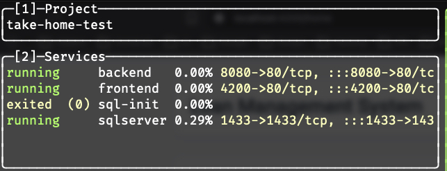
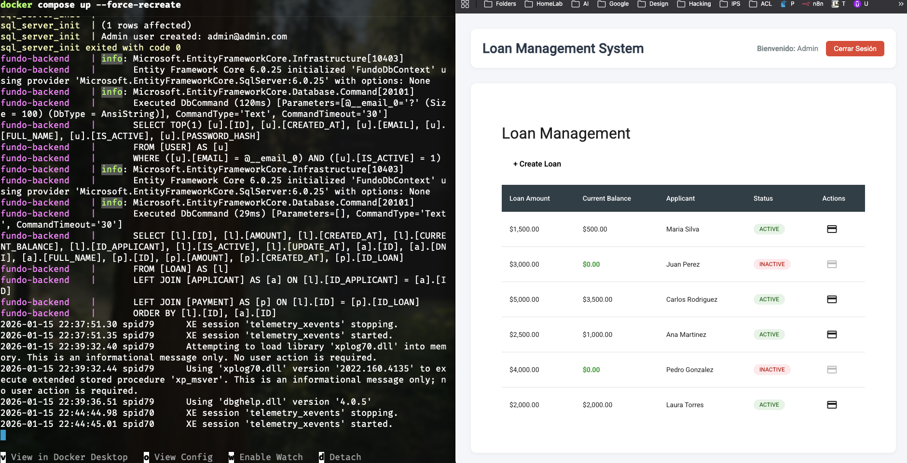
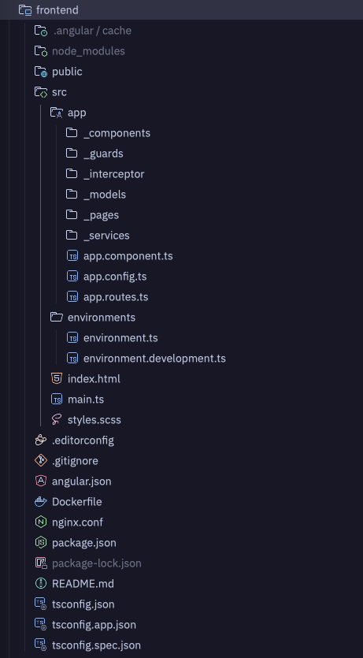
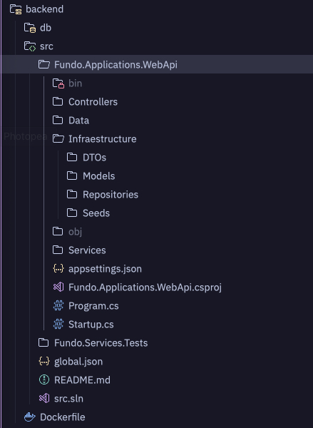
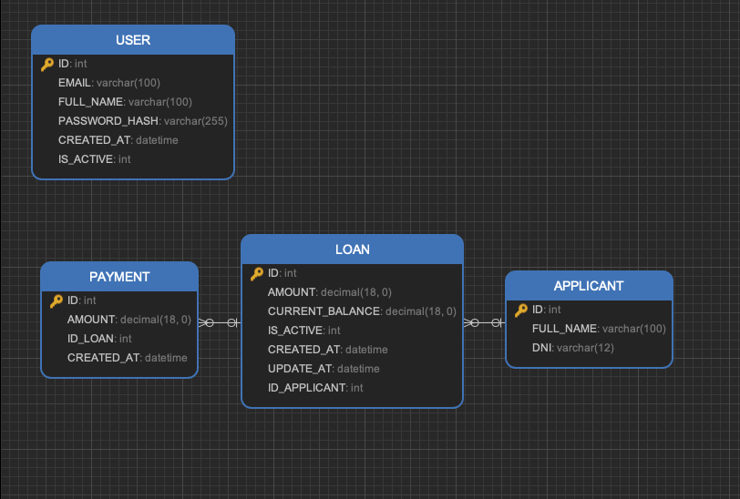
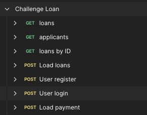

# **Take-Home Test: Backend-Focused Full-Stack Developer (.NET C#, Angular & Docker)**

## Solución por Felipe Mancilla -> https://felipemancilla.net

## Resumen
Proyecto creado como evidencia de conocimiento en las tecnologías utilizadas en el proyecto, para el sistema financiero, en este caso:
- Prestamos.
- Pagos de prestamos

Desde el backend y usando la API Post login puedes crear mas usuarios si lo deseas, las instrucciones estan un poco mas adelante para ese caso usando Postman, por defecto tenemos un usuario administrador con correo `admin@admin.com` y contraseña `asdf1234.,` para tener accesos a las funcionalidades del sistema y poder usar su JWT (Bearer), posterior a esto ya puedes crear usuarios, prestamos y pagos.

Desde el frontend puedes crear prestamos y pagos con clientes(applicants) existentes, se omitio a proposito un mantenedor por temas de optimizar tiempos, algo similar ocurre con los usuarios con la salvedad que aca si puedes crearlos directos desde postman teniendo un JWT valido y pasandolo como Bearer en el endpoint de registro. A su vez puedes ver los detalles de los prestamos y los pagos, puedes:

- Ver Prestamos.
- Crear los prestamos.
- Crear los pagos.

Funciones destacadas: 
- Login, protección de rutas, el sistema carece de roles para optimozar tiempos.
- No puedes pagar mas de lo que debes.
- Si pagas de forma parcial se va descontando la deuda.
- Si pagas todo el saldo la deuda desaparece y se desactiva la deuda mas el boton de acción.

El proyecto esta compuesto por:
- Backend: .NET 6 API con Dockerfile para contenerizar la aplicación.
- Frontend: Angular con Dockerfile para contenerizar la aplicación.
- Base de datos: SqlServer con Dockerfile para contenerizar la base de datos.
- Docker Compose para orquestar los contenedores.

## Requisitos
- Docker
- Docker Compose

## Instalación
1. Clonar el repositorio: `git clone https://github.com/felipemancilla/take-home-test.git`
2. Acceder al directorio del proyecto: `cd take-home-test`
3. Construir los contenedores: `docker-compose build`
4. Iniciar los contenedores: `docker-compose up`

## Uso
1. Abrir el navegador y acceder a la aplicación: `http://localhost:4200`
2. Iniciar sesión con las credenciales: `admin@admin.com` y `asdf1234.,`

## Postaman
- Dentro de esta carpeta puedes encontrar el archivo postman para probar las apis: postman/Challenge Loan.postman_collection.json

## composición:

- Frontend:

- Backend:

- Base de datos:

- Api:

